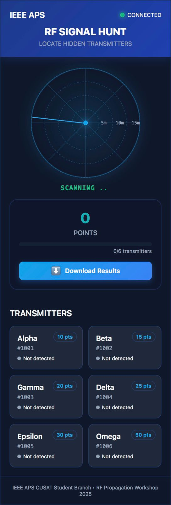

#  Signal Hunt

A campus-wide wireless treasure hunt game for educational events, developed by IEEE APS CUSAT Student Branch.

## 🎯 Overview

ESP-NOW Signal Hunt turns wireless signal theory into an interactive game where participants track hidden ESP32 transmitters around campus using signal strength. The project demonstrates practical applications of wireless propagation, signal processing, and modern IoT communication protocols.

## 🛠️ Hardware Requirements

### Receiver
- ESP32 DevKit module
- Battery for portable operation

### Transmitter
- ESP32 DevKit module
- Battery for portable operation
- Optional: LED indicator with resistor

## 🚀 Features

- **Interactive Radar Interface** - Real-time visualization of wireless signals
- **Multi-Transmitter Tracking** - Track up to 6 transmitters simultaneously
- **Signal Strength Indication** - Visual representation of signal strength
- **Distance Estimation** - Approximate distance to transmitters
- **Score System** - Points awarded for discovering transmitters
- **Persistent Storage** - Game progress saved between power cycles
- **Mobile-Friendly UI** - Responsive design works on any smartphone

## 📋 Workshop Structure

This project is designed as a two-phase educational event:

1. **Phase 1: Workshop** - Participants build and understand ESP-NOW receivers
2. **Phase 2: Signal Hunt** - Campus-wide competition to find hidden transmitters

## 📚 Documentation

- [Hardware Setup](docs/HARDWARE.md) - Detailed hardware assembly instructions
- [Setup Guide](docs/SETUP_GUIDE.md) - Software setup and configuration
- [Workshop Guide](docs/WORKSHOP.md) - How to run the workshop event

## 📱 Web Interface

The web interface features:
- Interactive radar display
- Signal strength indicators
- Score tracking
- Transmitter discovery list
- Status monitoring

## 📡 Technology Stack

- ESP32 for both receiver and transmitter
- ESP-NOW protocol for efficient direct device communication
- ESP32 WebServer for hosting the interface
- HTML/CSS/JS for the radar UI
- EEPROM for persistent storage

## 🔄 How It Works

1. Transmitters broadcast unique IDs via ESP-NOW protocol
2. Receivers detect signals and estimate distance based on signal strength (RSSI)
3. Web interface visualizes signals on a radar display
4. Participants navigate campus to find hidden transmitters
5. Points are awarded when a transmitter is found (within 5m range)

## 🔧 Installation

1. Clone this repository
2. Open `transmitter/espnow_signal_transmitter.ino` in Arduino IDE
3. Set unique `TRANSMITTER_ID` for each transmitter
4. Upload to ESP32 devices
5. Open `receiver/espnow_signal_hunt_receiver.ino` in Arduino IDE
6. Upload to ESP32 devices
7. Connect to receiver's WiFi AP (SSID: RF-SIGNAL-HUNT)
8. Navigate to http://192.168.4.1 in a web browser

## 📄 License

Released under the MIT License. See [LICENSE](LICENSE) for details.

## ✨ Credits

Developed by IEEE Antennas and Propagation Society (APS) CUSAT Student Branch.

---

Last Updated: June 30, 2025
